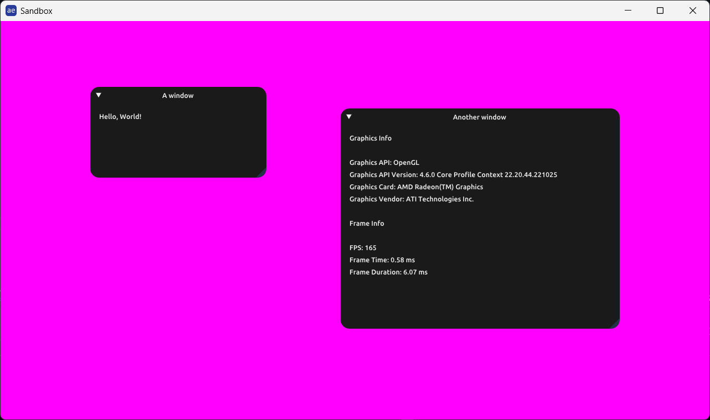

# App Library

## General

This library combines ten well-known APIs and libraries with additional wrapper and utility functionality. The aim of this library is to cover the basic boilerplate code required to use them together for graphics applications. The library is built using [Premake5](https://premake.github.io/) for `C++23`.

The APIs and libraries used are:
[OpenGL](https://www.opengl.org/), [GLFW](https://github.com/glfw/glfw), [GLEW](https://github.com/nigels-com/glew),
[Vulkan](https://www.vulkan.org/), [STB_Image](https://github.com/nothings/stb/blob/master/stb_image.h),
[STB_Image_Write](https://github.com/nothings/stb/blob/master/stb_image_write.h),
[STB_Vorbis](https://github.com/nothings/stb/blob/master/stb_vorbis.c),
[Dear ImGui](https://github.com/ocornut/imgui), [OpenAL Soft](https://github.com/kcat/openal-soft) and [GLM](https://github.com/g-truc/glm).

This library depends on [log-lib](https://github.com/rasmushugosson/log-lib), which is included as a git submodule.

## Getting Started

1. **Clone the repository** with submodules and open a terminal in the project root.
   ```bash
   git clone --recursive https://github.com/rasmushugosson/app-lib.git
   ```

The next steps depend on your preferred build system below.

### Visual Studio

2. Run `premake5 vs20XX` to generate a Visual Studio solution file (`.sln`).
3. Open the solution file in Visual Studio and build using MSVC.

### Gmake (force G++)

2. Run the pre-defined action `premake5 gmake-gcc` to generate makefiles specifically for GCC.
3. Navigate into `/build/[os]-gcc` where the `Makefile` is created.
4. Run `make config=[build type]` where the possible options are `debug`, `release` or `dist`.
5. Run the `Sandbox` executable from the project root: `./bin/Sandbox/[build type]/Sandbox`.

### Gmake (force Clang++)

2. Run the pre-defined action `premake5 gmake-clang` to generate makefiles specifically for Clang.
3. Navigate into `/build/[os]-clang` where the `Makefile` is created.
4. Run `make config=[build type]` where the possible options are `debug`, `release` or `dist`.
5. Run the `Sandbox` executable from the project root: `./bin/Sandbox/[build type]/Sandbox`.

### Formatting and Linting

There are additional actions for formatting with `clang-format` and linting through `clang-tidy`. These are run through:

```bash
# Run clang-format
premake5 format

# Run clang-tidy
premake5 lint

# Run clang-tidy and apply fixes
premake5 lint-fix
```

These commands assume `clang-format` and `clang-tidy` are installed on your system.

### Additional Dependencies

- **Premake5:** This library uses [Premake5](https://premake.github.io/) as its build configuration tool.
  Ensure that `premake5` is installed on your system or copied into the root folder.
  You can download it [here](https://premake.github.io/download/).

- **Graphics Drivers / SDKs:**
  - **OpenGL:** The library assumes OpenGL drivers are installed and available by default.
  - **Vulkan:** Optional. If Vulkan is not available, only the OpenGL graphics API will be usable.

- **Linux Dependencies:** On Linux, install the required system packages:
  ```bash
  # Debian/Ubuntu
  sudo apt install libglfw3-dev libglew-dev libopenal-dev

  # Arch Linux
  sudo pacman -S glfw glew openal
  ```

  For Vulkan support on Linux, install the Vulkan headers and validation layers:
  ```bash
  # Debian/Ubuntu
  sudo apt install vulkan-headers vulkan-validationlayers

  # Arch Linux
  sudo pacman -S vulkan-headers vulkan-validation-layers
  ```
  Note: Validation layers are only required for debug builds.

- **Windows Vulkan:** For Vulkan support on Windows, install the [Vulkan SDK](https://www.vulkan.org/tools#download-these-essential-development-tools). The SDK installer sets the `VULKAN_SDK` environment variable automatically, which the build system uses to locate Vulkan headers and libraries.

## Using as a Submodule

This library can be used as a git submodule in other Premake5 projects. Add it as a submodule (with recursive init to get log-lib) and include the App project definition in your `premake5.lua`:

```lua
include("path/to/app-lib/app-project.lua")

project("YourProject")
    -- ...
    includedirs({
        "path/to/app-lib/dep/log-lib/log-lib/include",
        "path/to/app-lib/app-lib/include",
        "path/to/app-lib/vendor/glm",
        "path/to/app-lib/vendor/imgui"
    })
    links({ "App", "ImGui", "STB", "Log" })
```

The `app-project.lua` file defines the App project and automatically includes the Log project and vendor dependencies. The `premake5.lua` is used for standalone builds including the Sandbox example.

## Usage

There are two main parts to this library: the `Window` class in the `Window.h` header file and the other utility classes and functions in the other header files. Header files for each of the third-party libraries are also provided as is.

### Window Class

The `Window` class is defined in the `Window.h` header file and is located in the `app-lib/include` folder. This class is a wrapper around [GLFW](https://github.com/glfw/glfw), [GLEW](https://github.com/nigels-com/glew) and [Dear ImGui](https://github.com/ocornut/imgui). It provides a simple way of creating a window, handling input events, adding interface components and setting up a rendering context.

To specify the properties of the created window, the `WindowDesc` struct is passed to the `Window` constructor:

```cpp
enum class GraphicsAPI
{
    OPENGL = 0,
    VULKAN
};

struct WindowDesc
{
    std::string title;       // The title of the window
    uint32_t width;          // The width of the window in pixels
    uint32_t height;         // The height of the window in pixels
    bool resizable;          // Whether the window is resizable
    bool minimizable;        // Whether the window can be minimized
    bool minimized;          // Whether the window is minimized
    bool maximizable;        // Whether the window can be maximized
    bool maximized;          // Whether the window is maximized
    bool fullscreen;         // Whether the window is fullscreen
    uint8_t monitor;         // The monitor on which the window should be displayed
    bool vsync;              // Whether vsync is enabled
    uint32_t fps;            // The target frames per second if vsync is disabled
    GraphicsAPI graphicsAPI; // The graphics API to create a context for
};
```

### Additional Header Files

The other header files in the `app-lib/include` folder contain utility classes and functions. `Files.h` is mostly a wrapper around [STB](https://github.com/nothings/stb) containing classes and methods for reading and writing image and audio files. The `OpenGL.h`, `Vulkan.h` and `OpenAL.h` header files each contain macros that check and throw custom exceptions for the respective API calls. The `DearImGui.h` and `OpenGLMaths.h` headers provide the third-party library interfaces.

### Build Configurations

The build configuration determines which logging macros from log-lib are active:

| Configuration | Define        | Logging                                      |
|---------------|---------------|----------------------------------------------|
| `debug`       | `AE_DEBUG`    | `AE_LOG()` and `AE_LOG_BOTH()` are active    |
| `release`     | `AE_RELEASE`  | `AE_LOG_RELEASE()` and `AE_LOG_BOTH()` are active |
| `dist`        | `AE_DIST`     | All logging disabled                         |

### Code Example

A complete example project demonstrating the library features can be found in `sandbox/src/Sandbox.cpp`. Below is a screenshot of the example program running.



## Third-party APIs/libraries

All third-party libraries included as source code have been modified to work with the project structure (precompiled header includes, altered include paths). No changes have been made to the functionality of the libraries.

### Bundled Libraries

| Library | Type | Location | License |
|---------|------|----------|---------|
| GLFW | Precompiled static lib | `dep/GLFW` | Zlib |
| GLEW | Precompiled static lib | `dep/GLEW` | Modified BSD / MIT |
| OpenAL Soft | DLL + import lib | `dep/OpenALSoft` | LGPL v2.1 |
| STB | Source | `vendor/stb` | Public Domain / MIT |
| Dear ImGui | Source | `vendor/imgui` | MIT |
| GLM | Header-only | `vendor/glm` | MIT |

### System Libraries (not bundled)

- **OpenGL:** Uses system OpenGL drivers
- **Vulkan:** Optional, requires [Vulkan SDK](https://www.vulkan.org/tools)

### OpenAL Soft Notice

OpenAL Soft is licensed under the **GNU Library General Public License (LGPL) v2.1**. It is distributed as a separate DLL to comply with the LGPL requirements, allowing end users to replace the OpenAL Soft DLL with a custom build if they wish.

For more information, see the license files in the `licenses/` folder and the [official repository](https://github.com/kcat/openal-soft).

### Third-party Licenses

All license texts can be found in the `licenses/` folder. If you use this library in your own projects, you must comply with the original licenses of the bundled libraries.

## Included Assets

The `res` folder contains assets used in the example program:
- `icons/` - Window icons of different sizes
- `cursors/` - Custom cursor images
- `fonts/` - Font used by Dear ImGui (Ubuntu font, licensed under Open Font License)

All assets except the font are created by me.

## Supported Platforms

- Windows (MSVC)
- Linux (GCC / Clang)
- Likely MacOS (not yet tested)

## License

This library (excluding mentioned third-party components) is licensed under the **Apache License 2.0**.
See the [LICENSE](LICENSE) file in this repository for details.
